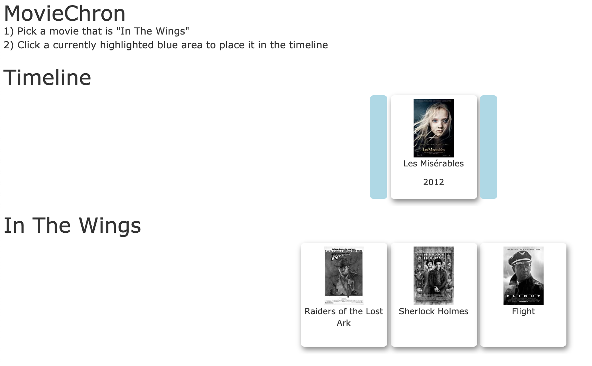
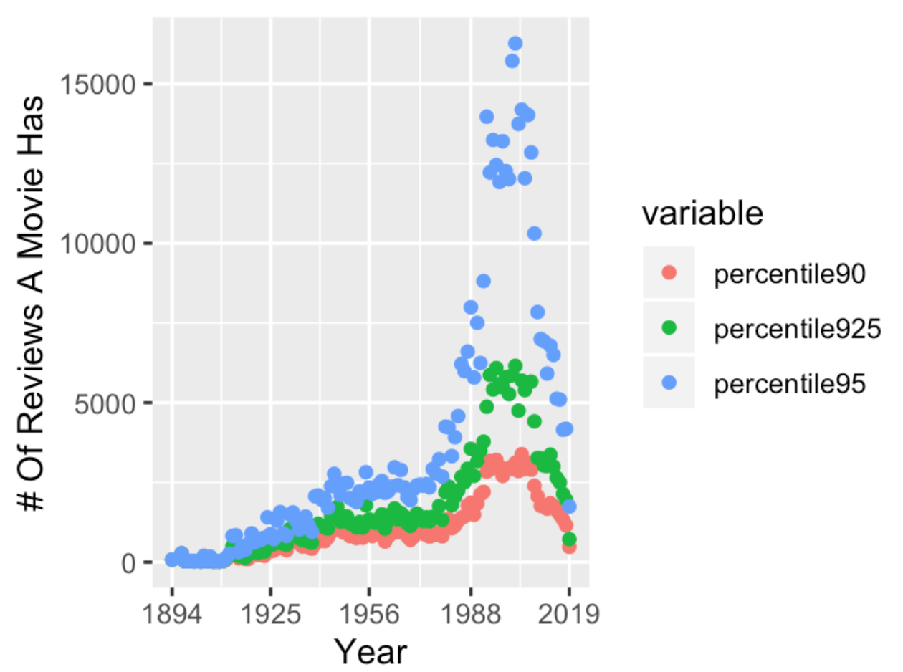

# MovieChron
This is a fun movie release date guessing game designed with the IMDb API, flask, and pandas. Players can choose their game difficulty and deck size (# of movies). They are then challenged to order all movies in their deck by release date. 

# Run Instructions
After cloning the repo locally, navigate to that repo in bash and use the command:
`source run.sh`
This will initiate the flask app. Go to the local url returned in bash to set up your game and begin playing.

# Game Play Example

# Game Difficulty Determination: 
Game difficulty is controlled by movie popularity. A more difficult game has more obscure movies that could be selected to make up a deck. Movie popularity is estimated by the # of votes it has recieved on IMDb and the year it is released. Older movies have fewer votes, so for each year, the percentile # of votes for each movie was determined as compared to all other movie released that year. The easiest game will be made up of movies that have votes at or exceeding the 95th percentile of all movies for that year, and so on. See the distribution below:

